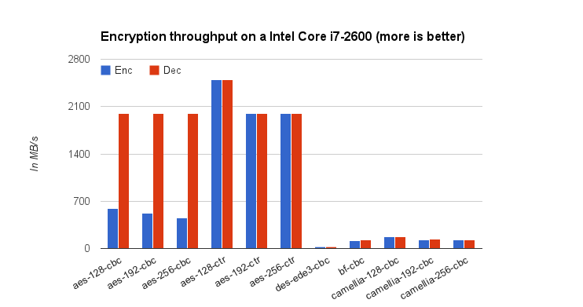
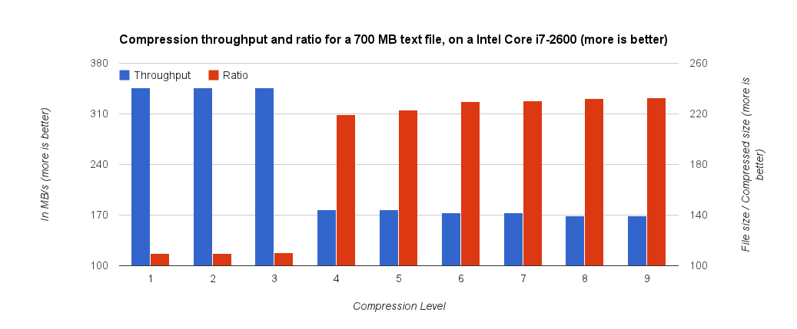

Performances
============

Cloud Gateway uses a lot of technical mecanisms to improve the user
experience by reducing latency and speeding up transfers:

-  a smart caching alogrithms, in order to keep the often-used files
   locally ;

-  constant monitoring of storage instances, to be able to choose the
   fastest one at any time ;

-  HTTP-multiplexing and connection pooling, to avoid opening a TCP
   connection if possible ;

-  compression, in case your bandwidth is the limiting factor.

Nevertheless, Cloud Gateway depends on the performance of some critical
parts.

PostgreSQL
----------

Cloud Gateway stores the filesystem metadata in a PostgreSQL database,
and therefore the performance of the database server is critical. For
most user, the default configuration of PostgreSQL will be fine, but for
those needing the best possible performance it is possible to tweak the
database configuration.

Tuning PostgreSQL configuration
~~~~~~~~~~~~~~~~~~~~~~~~~~~~~~~

While configuring a database server is a tricky job, here are some
pointers. The first thing one need to understand about database tuning
is that the best performance is obtained when most of the database data
are in memory, because disk accesses are slow. For PostgreSQL, this
means that the server should be allocated enough memory. The size of
memory allocated is controlled by the *shared\_buffers* option, and is
allocated once for a PostgreSQL service, not per connection. On a Cloud
Gateway host, *shared\_buffers* should be set somewhere between 1/8 and
1/4 of the total RAM of the host.

In addition, you will probably have to increase the maximum size of a
shared memory segment, in /etc/sysctl.conf (reboot required, use sysctl
otherwise):

.. code:: bash

    # for example, for 16 Go
    # Maximum size of shared memory segment (bytes)
    kernel.shmmax=17179869184
    # Total amount of shared memory available (pages)
    kernel.shmall=4194304

Then, set the *effective\_cache\_size* option to the value you expect to
be free for use by the kernel for disk caching and the postgresql
*shared\_buffers*. This is an indication, not an allocation, so 3/4 of
your host’s memory is a good bet if PostgreSQL is the only service
running on that host (1/4 if Cloud Gateway is running on the same host).

If you have a write-intensive setup, you can try to increase
*wal\_buffers* option which, beginning with PostgreSQL 9.1, defaults to
1/32 of *shared\_buffers*, with an upper limit of 16MB. *wal\_buffers*
is allocated once for a PostgreSQL service, not per connection.

For more indications on PostgreSQL tuning, you can refer to
http://wiki.postgresql.org/wiki/Tuning_Your_PostgreSQL_Server or to the
book of Gregory Smith, *PostgreSQL 9.0 High Performance*, which is
freely available on internet at http://it-ebooks.info/book/1453/.

Deporting the PostgreSQL server
~~~~~~~~~~~~~~~~~~~~~~~~~~~~~~~

It may happen that the host where Cloud Gateway is installed is running
out of resources, be it CPU, disk I/O or memory. In this case, we advise
to deport the PostgreSQL server to another host. This can easily be done
by dumping the existing database with the *pg\_dump*, importing it on
the new server and then editing the *DB/Specifics/ConnectionString* in
the *CloudGatewayConfiguration.xml* file.

For example, in order to dump (as root) the existing database named
*cloudgw\_db*:

.. code:: bash

    $ pg_dump cloudgw_db -f cloudgw_db_dump.sql

Then, on the new server :

.. code:: bash

    $ psql -d cloudgw_db -f cloudgw_db_dump.sql

Setting up a PostgreSQL cluster
~~~~~~~~~~~~~~~~~~~~~~~~~~~~~~~

For very heavy load, a single database server may not be enough.
Beginning with version 1.1.2, Cloud Gateway supports the use of a
different connection for altering statements (insert, update, delete)
and read-only statements, thus enabling the use of a master and a ferm
of slaves. The connection string for the master should stay in the
*DB/Specifics/ConnectionString* directive, while the connection string
for the read-only statements has to be specified in the
*DB/Specifics/ReadOnlyConnectionString*.

Cache
-----

After the PostgreSQL server, the cache is the most critical component of
Cloud Gateway performance-wise. While a sub-directory of the root
partition will work finely for a light load, a dedicated, fast hard
drive will be needed for a moderate load. In order to do obtain the best
possible user experience, Nuage Labs recommends the use of Solid State
Drive [15]_ for reduced latency and better throughput, as this
technology is now available for a cheap price.

For the most intensive setups, Nuage Labs recommends a dedicated RAID
array of disks, the exact type being very dependant on the data
typology. Please contact your reseller for more information.

Network
-------

While Cloud Gateway is trying very hard to always have the data you need
in its cache, a time will always come when the file you need will have
to be retrieved from your cloud storage provider. For this reason, we
advise that Cloud Gateway is provided with the fastest access to the
cloud storage possible, and that the network link to the cloud storage
be kept separated from the network link used to provide users access to
data, as Cloud Gateway has no problem using 100 percent of a Gigabit
link if configured to do so.

Encryption
----------

Encryption has a high CPU cost, depending on the CPU hardware support
and the algorithm used. Recent CPU supporting the AES instruction set
(also known as Intel AES-NI) are very fast at AES encoding, as shown in
the following picture. The following benchmark has been realised using a
modest Intel Core i7-2600 CPU:

Encryption is used in two places in Cloud Gateway, first when using an
HTTPS endpoint, and when using the encryption filter.

Digest
------

Digest algorithm are used to verify the integrity of files during
transfers, if the *Configuration/Instances/Instance/CheckObjectHash*
option is set to true. Almost all providers use the *MD5* algorithm,
which has a relatively low CPU-cost.

They are also used to check the integrity of files by comparing the
content of objects before they are sent to the provider and after they
are retrieved. This operation is controlled by the
*Configuration/Filesystems/FileSystem/InodeDigestAlgorithm* setting, and
defaults to use the *SHA-256* digest algorithm, which is a bit slower
than *MD5*. The following picture compares the different algorithms
availables on a single core:

.. image:: images/benchs-digests-en.png
   :alt: Digests performance in Cloud Gateway on a single core

If you want maximum performances and do not care about object integrity,
it is possible to disable these two checks.

Compression
-----------

Compression is a very good way to save bandwidth and storage costs, but
it comes with a high impact on CPU processing time and memory
consumption, depending of the compression level chosen. The following
benchmark has been realised using a modest Intel Core i7-2600 CPU, on a
plain text log file:

.. [15]
   SSD
